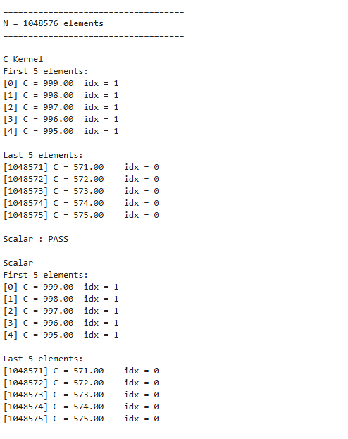
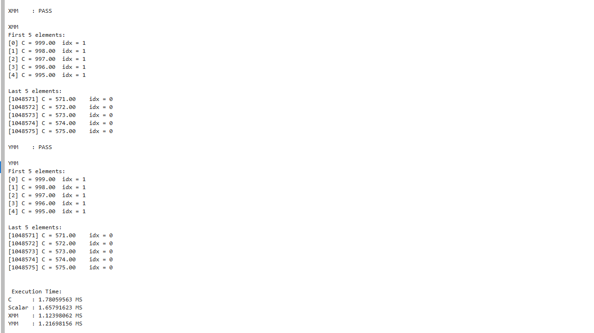

# SIMD 

## General Program Outputs

## Results and Discussion
The data below shows the performance between C, Scalar Assembly,XMM and YMM. Each implementation was executed 30 times for the 3 input sizes (2^20,2^26,2^30). Execution time was measured in miliseconds and speedup was calculated relative to the C Implementation. SIMD implementations achieved the greatest performance improvements, particularly the XMM implementation. This is due to the implementations being able to process multiple data elements simultaneously rather than processing each element individually. The YMM in theory should be able to be faster than XMM since it has a wider register however as the input size grows where the working set is larger than the processor's cache used in the virtual environment (Xeon). The processor spends more time transferring data between DRAM and CPU than performing the instruction when processing through higher input sizes. The kernels were ran on Jupyter Notebook which could introduce a timing variability. A conclusion we could see from this is that the AVX frequency is reduced with the Intel Xeon Gold 5115 which is supported by this article from intel (https://www.intel.com/content/www/us/en/support/articles/000036924/processors/intel-xeon-processors.html)  where they state that vectorized applications generating high load on the processor cores may require more power and generate more heat which results in the reduction of frequency.

## Input Size: 2^20 Elements

| Run | C (ms) | Scalar (ms) | XMM (ms) | YMM (ms) |
|----:|-------:|------------:|---------:|---------:|
| 1 | 1.78 | 1.52 | 1.10 | 1.26 |
| 2 | 1.93 | 1.79 | 1.34 | 1.55 |
| 3 | 1.81 | 1.68 | 1.22 | 1.32 |
| 4 | 1.83 | 1.62 | 1.28 | 1.34 |
| 5 | 1.80 | 2.94 | 1.65 | 1.35 |
| 6 | 1.92 | 1.76 | 1.48 | 1.48 |
| 7 | 1.87 | 1.78 | 1.26 | 1.37 |
| 8 | 1.83 | 1.73 | 1.32 | 1.36 |
| 9 | 1.85 | 1.69 | 1.28 | 1.24 |
| 10 | 1.86 | 1.76 | 1.32 | 1.52 |
| 11 | 1.92 | 1.69 | 1.29 | 1.33 |
| 12 | 1.91 | 1.79 | 1.44 | 1.40 |
| 13 | 1.95 | 1.70 | 1.19 | 1.20 |
| 14 | 1.82 | 1.73 | 1.30 | 1.35 |
| 15 | 1.92 | 1.70 | 1.28 | 1.29 |
| 16 | 1.88 | 1.63 | 1.31 | 1.45 |
| 17 | 1.82 | 1.68 | 1.34 | 1.29 |
| 18 | 1.92 | 1.76 | 1.34 | 1.40 |
| 19 | 1.89 | 1.69 | 1.37 | 1.46 |
| 20 | 1.95 | 1.66 | 1.22 | 1.30 |
| 21 | 1.96 | 1.76 | 1.40 | 1.51 |
| 22 | 1.81 | 1.66 | 1.31 | 1.42 |
| 23 | 1.86 | 1.75 | 1.35 | 1.38 |
| 24 | 1.84 | 1.86 | 1.33 | 1.38 |
| 25 | 1.89 | 1.73 | 1.37 | 1.45 |
| 26 | 1.77 | 1.55 | 1.09 | 1.11 |
| 27 | 1.86 | 1.63 | 1.29 | 1.41 |
| 28 | 1.86 | 1.64 | 1.26 | 1.32 |
| 29 | 1.99 | 1.82 | 1.41 | 1.50 |
| 30 | 1.92 | 1.71 | 1.29 | 1.34 |
| **Average** |1.874 | 1.747 | 1.314 |1.369|

## Input Size: 2^26 Elements

| Run | C (ms) | Scalar (ms) | XMM (ms) | YMM (ms) |
|----:|-------:|------------:|---------:|---------:|
| 1 | 132.09 | 126.25 | 102.79 | 140.47 |
| 2 | 129.69 | 126.85 | 102.75 | 112.69 |
| 3 | 133.16 | 126.26 | 102.90 | 113.80 |
| 4 | 132.79 | 127.30 | 103.14 | 131.44 |
| 5 | 133.29 | 125.82 | 102.26 | 115.97 |
| 6 | 133.45 | 124.81 | 102.27 | 113.69 |
| 7 | 133.67 | 127.68 | 103.15 | 114.59 |
| 8 | 132.96 | 126.13 | 102.27 | 113.39 |
| 9 | 136.48 | 126.31 | 102.77 | 129.31 |
| 10 | 132.79 | 124.80 | 102.46 | 113.87 |
| 11 | 133.39 | 125.32 | 103.04 | 129.43 |
| 12 | 130.83 | 127.54 | 104.35 | 130.71 |
| 13 | 133.26 | 124.72 | 104.19 | 130.11 |
| 14 | 130.60 | 124.57 | 103.32 | 113.84 |
| 15 | 133.94 | 127.09 | 104.11 | 152.37 |
| 16 | 130.78 | 126.44 | 103.99 | 130.70 |
| 17 | 130.80 | 124.71 | 102.39 | 130.30 |
| 18 | 135.36 | 126.77 | 102.69 | 129.59 |
| 19 | 131.31 | 124.14 | 102.73 | 129.69 |
| 20 | 131.86 | 124.78 | 102.00 | 130.17 |
| 21 | 132.42 | 126.89 | 102.87 | 130.39 |
| 22 | 131.96 | 126.58 | 103.48 | 130.05 |
| 23 | 133.18 | 123.78 | 102.67 | 129.61 |
| 24 | 132.24 | 126.38 | 102.90 | 131.46 |
| 25 | 133.03 | 125.18 | 102.46 | 130.05 |
| 26 | 132.86 | 125.80 | 104.85 | 129.74 |
| 27 | 132.78 | 125.61 | 102.79 | 114.87 |
| 28 | 132.75 | 127.49 | 103.41 | 130.41 |
| 29 | 129.33 | 124.42 | 102.80 | 131.68 |
| 30 | 134.22 | 125.79 | 102.92 | 130.81 |
| **Average** | **132.49** | **125.81** | **103.01** | **126.64** |

## Input Size: 2^30 Elements

| Run | C (ms) | Scalar (ms) | XMM (ms) | YMM (ms) |
|----:|-------:|------------:|---------:|---------:|
| 1 | 2114.95 | 2059.20 | 1710.97 | 1830.68 |
| 2 | 2154.56 | 2032.33 | 1689.18 | 1816.12 |
| 3 | 2138.01 | 2052.59 | 1704.39 | 1848.16 |
| 4 | 2163.18 | 2029.17 | 1685.74 | 1844.58 |
| 5 | 2155.65 | 2087.86 | 1702.04 | 1846.75 |
| 6 | 2134.78 | 2033.15 | 1690.09 | 1843.16 |
| 7 | 2136.33 | 2051.44 | 1696.96 | 1840.16 |
| 8 | 2141.23 | 2048.03 | 1692.87 | 1846.71 |
| 9 | 2148.19 | 2075.44 | 1707.77 | 1827.96 |
| 10 | 2123.00 | 2035.68 | 1690.71 | 1840.77 |
| 11 | 2151.88 | 2053.51 | 1691.17 | 1836.55 |
| 12 | 2130.04 | 2094.46 | 1706.77 | 1831.19 |
| 13 | 2140.83 | 2047.80 | 1687.37 | 1876.64 |
| 14 | 2134.48 | 2036.69 | 1692.61 | 1828.94 |
| 15 | 2132.31 | 2051.97 | 1696.00 | 1826.11 |
| 16 | 2128.63 | 2053.82 | 1688.84 | 1828.54 |
| 17 | 2133.01 | 2054.98 | 1692.89 | 1835.57 |
| 18 | 2150.31 | 2050.12 | 1691.11 | 1834.81 |
| 19 | 2181.57 | 2062.85 | 1700.68 | 1831.80 |
| 20 | 2162.45 | 2045.06 | 1679.83 | 1846.38 |
| 21 | 2148.46 | 2037.91 | 1685.34 | 1853.94 |
| 22 | 2117.09 | 2051.79 | 1712.19 | 1826.33 |
| 23 | 2128.42 | 2057.10 | 1804.91 | 1827.55 |
| 24 | 2146.66 | 2059.67 | 1690.78 | 1836.29 |
| 25 | 2116.73 | 2048.01 | 1692.24 | 1827.92 |
| 26 | 2122.77 | 2068.54 | 1689.44 | 1835.46 |
| 27 | 2133.67 | 2036.49 | 1691.77 | 1814.14 |
| 28 | 2147.06 | 2041.37 | 1686.19 | 1816.58 |
| 29 | 2140.31 | 2069.17 | 1691.27 | 1833.61 |
| 30 | 2166.87 | 2050.77 | 1693.47 | 1856.16 |
| **Average** | **2140.78** | **2052.57** | **1697.85** | **1836.32** |

# Speedup Summary
\[
\text{Speedup} = \frac{\text{Average C Execution Time}}{\text{Average SIMD/Assembly Execution Time}}
\]

| Input Size | Scalar Speedup | XMM Speedup | YMM Speedup |
|------------|---------------:|------------:|------------:|
| 1,048,576 | **1.07×** | **1.43×** | **1.37×** |
| 67,108,864 | **1.05×** | **1.29×** | **1.05×** |
| 1,073,741,824 | **1.04×** | **1.26×** | **1.17×** |

# Performance Improvement
| Input Size | Scalar | XMM | YMM |
|------------|--------:|----:|----:|
| 1,048,576 | **6.8%** | **42.6%** | **36.9%** |
| 67,108,864 | **5.3%** | **28.6%** | **4.6%** |
| 1,073,741,824 | **4.3%** | **26.1%** | **16.6%** |

